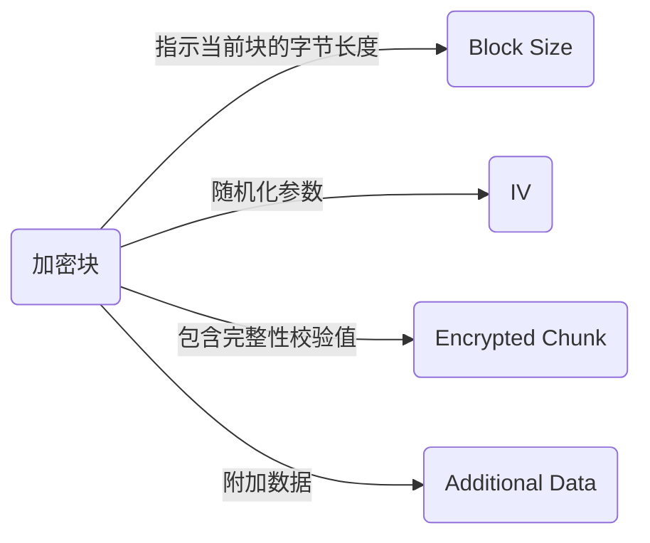

[中文]() | [English]()

# 引言

这是一个流式 AES-GCM 加解密库，使用 `Web Stream API` 与 `Web Crypto API`
，零依赖，并具有高度的可自定义性，理论上支持浏览器，Deno 和 Node（未测试）。

## 基本用法

```typescript
import { AesGcmDecryptionStream , AesGcmEncryptionStream , createKey } from"./mod.ts";
const key = await createKey(new Uint8Array([ .. ]));
const 加密流 = new AesGcmEncryptionStream({ key });
const 解密流 = new AesGcmDecryptionStream({ key });
// ...Stream 操作
```

在以上代码中

- `Uint8Array`字节长度为16指AES-128，24指AES-192， 32指AES-256。
- 我们只用到了`key`这个参数，其余参数有默认值，多数情况下无需关心。
- 以上代码适用于加密与解密都使用本库的情况，其余情况请看进阶用法。

## 进阶用法

在使用进阶用法之前，你需要了解一些信息

默认情况下，本库封装的加密块表现为如下格式：



| 元素            | 参数                       | 信息                                                                                                   |
| --------------- | -------------------------- | ------------------------------------------------------------------------------------------------------ |
| Block Size      | 可选。固定4字节            | 指示当前块的字节长度，包含自身长度，用于保证接收方数据完整性                                           |
| IV              | 可选。默认12字节，长度可变 | 未指定时，每个块随机一个并且必须附加；指定时不附加，且在一个加密会话中所有块会使用同一个IV，降低安全性 |
| Encrypted Data  | 末尾包含完整性校验值       | 解密时Web Crypto API会自动进行完整性校验                                                               |
| Additional Data | 可选。但必须定长           | 解密时需要它的长度以便正确分离数据                                                                     |

注：可选指可不附加在加密块中

---

### `new AesGcmEncryptionStream({ .. })`支持的参数：

| name            | 作用                         | 信息                                                                                                                                                                      |
| --------------- | ---------------------------- | ------------------------------------------------------------------------------------------------------------------------------------------------------------------------- |
| key             | 加密密钥                     | 决定AES-128 or 192 or 256                                                                                                                                                 |
| ivPrefix        | 是否将iv附加到加密块         | 默认为true。指定为false后表示不将iv附加到加密块，此时必须指定一个固定iv作为本次加密会话中所有加密块的iv                                                                   |
| iv              | 随机化向量                   | 一般不指定，随机为每个块设置一个iv且必须附加。指定时作为本次加密会话中所有加密块的iv，可以不附加                                                                          |
| ivByteLength    | iv的字节长度                 | 默认为12，可指定为16，更安全。指定iv则使用导入iv的字节长度，本参数被忽略                                                                                                  |
| additionalData  | 附加数据                     | 默认为空Uint8Array。指定时必须定长，接收时需要导入它的长度，会被附加到每个加密块的末尾                                                                                    |
| tagLength       | 完整性校验标签的比特长度     | 默认为128，可指定值依具体平台而定，一般小于128                                                                                                                            |
| blockSizePrefix | 是否将块大小数据附加到加密块 | 4字节长度，默认为true，用于保证接收方数据的完整性。指定为false后，请保证一次写入到加密流的块大小与一次写入到解密流的块大小一致且固定                                      |
| concatData      | 构造加密块的方式             | 一个函数，有iv,encryptedChunk,additionalData三个参数，默认拼接顺序为iv-encryptedChunk-additionalData，ivPrefix为false时不拼接iv。需要自定义拼接顺序请使用库中的concat函数 |

### `new AesGcmDecryptionStream({ .. })`支持的参数：

| name                     | 作用                             | 信息                                                                                                                                                                                                                                                                                                                                                                                                                                                                                                                                                                             |
| ------------------------ | -------------------------------- | -------------------------------------------------------------------------------------------------------------------------------------------------------------------------------------------------------------------------------------------------------------------------------------------------------------------------------------------------------------------------------------------------------------------------------------------------------------------------------------------------------------------------------------------------------------------------------- |
| key                      | 解密密钥                         | 必须与加密密钥相同                                                                                                                                                                                                                                                                                                                                                                                                                                                                                                                                                               |
| useIvPrefix              | 是否使用附加到加密块上的iv       | 默认为true。指定为false时必须指定iv，此时本解密会话上的所有加密块将会使用此iv                                                                                                                                                                                                                                                                                                                                                                                                                                                                                                    |
| iv                       | 随机化向量                       | 一般不指定，使用加密块附加的iv。指定时本解密会话上的所有加密块将会使用此iv                                                                                                                                                                                                                                                                                                                                                                                                                                                                                                       |
| ivByteLength             | iv的字节长度                     | 默认为12，用于从加密流中分离iv。指定iv且useIvProfix为true(默认)时为指定iv的长度，指定iv但useIvProfix为false时为0;不指定iv时，对该参数的指定生效                                                                                                                                                                                                                                                                                                                                                                                                                                  |
| tagLength                | 完整性校验标签的比特长度         | 默认为128。指定时必须与对应加密会话一致，一般小于128                                                                                                                                                                                                                                                                                                                                                                                                                                                                                                                             |
| additionalDataByteLength | 附加数据的字节长度               | 默认为0。指定时必须与加密会话的参数对应，用于从解密块中分离附加数据                                                                                                                                                                                                                                                                                                                                                                                                                                                                                                              |
| useBlockSizePrefix       | 是否使用附加到加密块的块大小数据 | 默认为true，用于保证接收方数据的完整性。指定为false后，请保证一次写入到加密流的块大小与一次写入到解密流的块大小一致且固定                                                                                                                                                                                                                                                                                                                                                                                                                                                        |
| separateData             | 分离加密块的方式                 | 一个函数，receivedData，ivByteLength，additionalDataByteLength三个参数，默认分离顺序为blockSize-iv-encryptedChunk-additionalData，useBlockSizePrefix为false时表示块中没有块大小前缀，此时不分离blockSize。需要自定义分离顺序时，用库中的uint8ArrayToDecimal(receivedData.subarray(0, 4))取出块大小信息；指定iv时可用this.iv取出iv，未指定则用Uint8Array.subarray方法从加密块中取出，其余数据以此类推，最后像这样返回：return { blockSize, iv, encryptedChunk, additionalData };。注意使用函数提供的参数以及取出的顺序对应加密流中构造加密块的顺序，推荐用Uint8Array.subarray方法 |

我不得不承认这些确实很复杂🥲，但这样才能保证这个库的兼容性及可自定义性。

---

## 后记

我写这个库的目的是加密一个tunnel中的数据(🪜🧱)，需要一个支持可变块大小的AES-GCM流式加解密库，我当时找遍了全网，没有一个能够实现我的需求，于是特地写了这个库。

欢迎各位使用本库。
