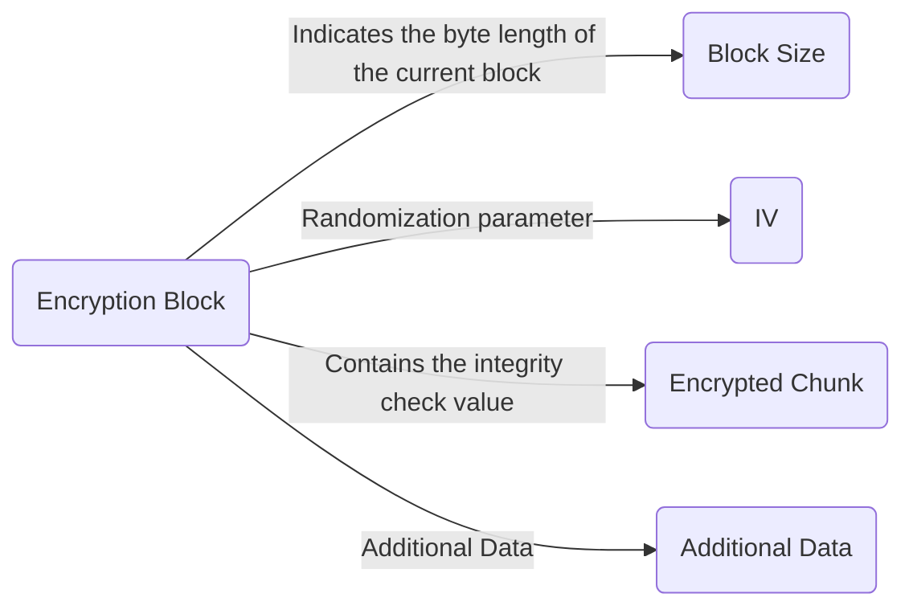

[中文](./README.md) | [English](./README_en.md)

# Introduction

_This document was translated by artificial intelligence._

This is a streaming AES-GCM encryption and decryption library that uses
`Web Stream API` and `Web Crypto API`, has zero dependencies, and is highly
customizable. It is theoretically compatible with browsers, Deno, and Node
(untested).

## Basic Usage

```typescript
import { AesGcmDecryptionStream, AesGcmEncryptionStream, createKey } from "./mod.ts";
const key = await createKey(new Uint8Array([..]));
const encryptionStream = new AesGcmEncryptionStream({ key });
const decryptionStream = new AesGcmDecryptionStream({ key });
// ...Stream operations
```

In the code above:

- The byte length of the `Uint8Array` determines whether AES-128, AES-192, or
  AES-256 is being used.
- We only use the `key` parameter here, as most other parameters have default
  values that should suffice in most cases.
- This code is suitable for cases where both encryption and decryption use this
  library. For other cases, please refer to the advanced usage section.

## Advanced Usage

Before using the advanced features, you need to understand some information.

By default, the encryption block encapsulated by this library has the following
format:



| Element         | Parameter                                     | Information                                                                                                                                                                                       |
| --------------- | --------------------------------------------- | ------------------------------------------------------------------------------------------------------------------------------------------------------------------------------------------------- |
| Block Size      | Optional. Fixed 4 bytes                       | Indicates the byte length of the current block, including its own length, to ensure data integrity.                                                                                               |
| IV              | Optional. Default 12 bytes, variable length   | If unspecified, a random IV is generated for each block and must be attached. If specified, it is not attached, and all blocks in the encryption session will use the same IV, reducing security. |
| Encrypted Data  | Contains the integrity check value at the end | The Web Crypto API automatically performs integrity checks during decryption.                                                                                                                     |
| Additional Data | Optional. Must be of fixed length             | Its length is required during decryption to correctly separate the data.                                                                                                                          |

---

### Parameters supported by `new AesGcmEncryptionStream({ .. })`:

| Name            | Purpose                                                   | Information                                                                                                                                                                                                                                                                                           |
| --------------- | --------------------------------------------------------- | ----------------------------------------------------------------------------------------------------------------------------------------------------------------------------------------------------------------------------------------------------------------------------------------------------- |
| key             | Encryption key                                            | Determines whether AES-128 or 192 or 256 is used                                                                                                                                                                                                                                                      |
| ivPrefix        | Whether to attach iv to the encryption block              | Default is true. When set to false, it means that the iv is not attached to the encryption block, and a fixed iv must be specified as the iv for all encryption blocks in this encryption session.                                                                                                    |
| iv              | Randomization vector                                      | Generally not specified. When specified, it is used as the iv for all encryption blocks in this encryption session and does not need to be attached.                                                                                                                                                  |
| ivByteLength    | Length of the iv in bytes                                 | Default is 12, but can be specified as 16 for increased security. If the iv is specified, this parameter is ignored.                                                                                                                                                                                  |
| additionalData  | Additional data                                           | Default is an empty `Uint8Array`. When specified, it must be of fixed length, and its length is attached to the end of each encryption block.                                                                                                                                                         |
| tagLength       | Bit length of the integrity check tag                     | Default is 128, but value may depend on the specific platform and is generally less than 128.                                                                                                                                                                                                         |
| blockSizePrefix | Whether to attach block size data to the encryption block | 4 bytes in length by default, and true by default to ensure data integrity. When set to false, the size of the block written to the encryption stream must be consistent and fixed with that written to the decryption stream.                                                                        |
| concatData      | How to construct the encryption block                     | A function with three parameters: `iv`, `encryptedChunk`, and `additionalData`. The default concatenation order is `iv-encryptedChunk-additionalData`, and when `ivPrefix` is false, iv is not concatenated. To customize the concatenation order, use the `concat` function provided by the library. |

### Parameters supported by `new AesGcmDecryptionStream({ .. })`:

| Name            | Purpose                                                  | Information                                                                                                                                                                                                                                                                                                                                                                                                                                                                                                                                                                                                                                                                                                                                                                                                                                                                                                                                                                                                                    |
| --------------- | -------------------------------------------------------- | ------------------------------------------------------------------------------------------------------------------------------------------------------------------------------------------------------------------------------------------------------------------------------------------------------------------------------------------------------------------------------------------------------------------------------------------------------------------------------------------------------------------------------------------------------------------------------------------------------------------------------------------------------------------------------------------------------------------------------------------------------------------------------------------------------------------------------------------------------------------------------------------------------------------------------------------------------------------------------------------------------------------------------ |
| key             | Decryption key                                           | Determines whether AES-128 or 192 or 256 is used                                                                                                                                                                                                                                                                                                                                                                                                                                                                                                                                                                                                                                                                                                                                                                                                                                                                                                                                                                               |
| ivPrefix        | Whether the iv is attached to the encryption block       | Default is true.When set to false, it means that the iv is not attached to the encryption block,and a fixed iv must be specified as the iv for all encryption blocks in this encryption session.                                                                                                                                                                                                                                                                                                                                                                                                                                                                                                                                                                                                                                                                                                                                                                                                                               |
| additionalData  | Additional data                                          | Default is an empty `Uint8Array`. When specified, it must be of fixed length, and its length is attached to the end of each encryption block.                                                                                                                                                                                                                                                                                                                                                                                                                                                                                                                                                                                                                                                                                                                                                                                                                                                                                  |
| tagLength       | Bit length of theintegrity check tag                     | Default is 128, but value may depend on the specificplatform and is generally less than 128.                                                                                                                                                                                                                                                                                                                                                                                                                                                                                                                                                                                                                                                                                                                                                                                                                                                                                                                                   |
| blockSizePrefix | Whether to attachblock size data to the encryption block | Default is true to ensure data integrity. When set to false, the size of the block written to the decryption stream must be consistent and fixed with that written to the encryption stream.                                                                                                                                                                                                                                                                                                                                                                                                                                                                                                                                                                                                                                                                                                                                                                                                                                   |
| separateData    | How to separate the encryption block                     | separateData is a function used to separate encrypted blocks. It takes three parameters: receivedData, ivByteLength, and additionalDataByteLength. By default, the separation order is blockSize-iv-encryptedChunk-additionalData. When useBlockSizePrefix is set to false, it means there is no block size prefix in the blocks, and blockSize will not be separated. To customize the separation order, use the uint8ArrayToDecimal function in the library to extract the block size information from receivedData.subarray(0, 4). To specify the IV, use this.iv if it is specified, or use Uint8Array.subarray method to extract it from the encrypted block. The same applies to the other data. Finally, return { blockSize, iv, encryptedChunk, additionalData } in the specified order. It is important to use the parameters provided by the function and extract the data in the correct order to ensure compatibility and customizability of the library. It is recommended to use the Uint8Array.subarray method. |

## Afterword

I must admit that this is quite complex🥲, but it is necessary to ensure
compatibility and customizability of the library.

The purpose of this library is to encrypt data in a tunnel (🧱). It requires a
streamable AES-GCM encryption library with variable block sizes. When I searched
the entire web, I couldn't find any library that met my requirements, so I wrote
this library.

Feel free to use this library.
